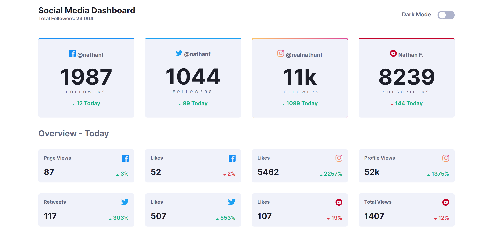

# social-media-dashboard-with-theme-switcher-master

## Overview

### The challenge

Users should be able to:

- View the optimal layout for the site depending on their device's screen size
- See hover states for all interactive elements on the page
- Toggle color theme to their preference

### Screenshot

### Links

- Live Site URL: [Add live site URL here](https://yonathan-palma.github.io/social-media-dashboard-with-theme-switcher-master/)

## My process

### Built with

- Semantic HTML5 markup
- CSS custom properties
- Flexbox
- CSS Grid
- Mobile-first workflow

### Useful resources

- [setProperty](https://developer.mozilla.org/en-US/docs/Web/API/CSSStyleDeclaration/setProperty)

## Author

- Website - [Yonathan Palma](https://github.com/yonathan-palma)
- Frontend Mentor - [@yonathan-palma](https://www.frontendmentor.io/profile/yonathan-palma)
